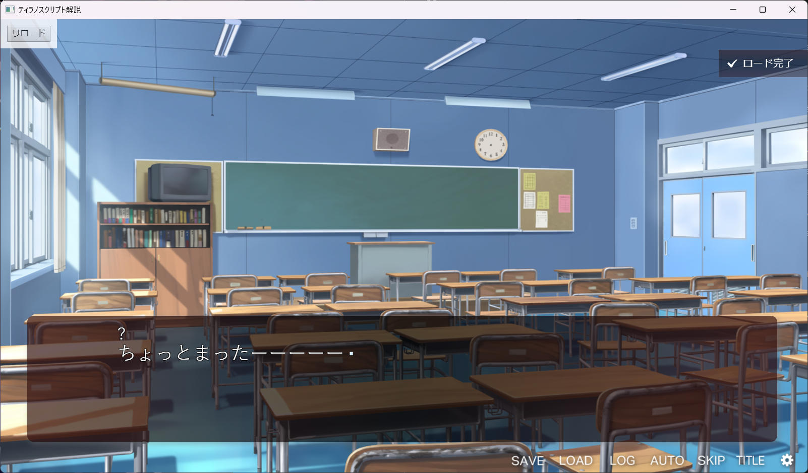

# Complete Pop for TyranoScript v5

## 概要

TyranoScript v5.00向けのプラグインです。（ES2015記法のため)

TyranoScriptがセーブ・ロードを完了させたとき、通知が表示されます。

### 特徴

タグの指定等必要なく、このプラグインをロード後に機能が有効になります。

## 使い方

complete_popフォルダをそのままプロジェクトの「data/others/plugin/」に入れてください。

その後、first.ksに`@plugin name="complete_pop"`を追記してください。
この記述の直後からプラグインが使用できるようになります。

お問合せ: 
- mail: makiro.fuse@gmail.com
- twitter: [@makiro152](https://twitter.com/makiro152)
